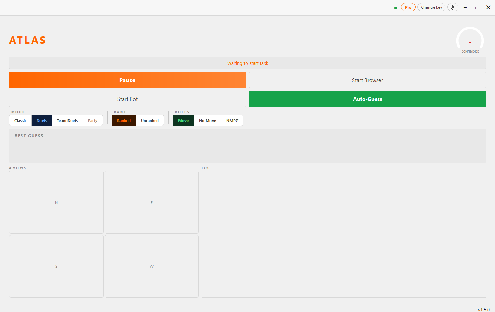

# ATLAS - AI GeoGuessr Cheat, Bot and Auto-Guess Tool

  

  <b>The #1 AI-powered GeoGuessr cheat and bot.</b> 
  Predicts any location in under 3 seconds with high accuracy across 108 countries. 
  Full Auto-Guess bot for Duels, Team Duels, Move, No Move and NMPZ.

  <a href="https://geoguessrcheats.com"><b>Get started at geoguessrcheats.com</b></a> &middot;
  <a href="https://discord.gg/pFzUkAjTHr">Join the Discord</a>

## What is ATLAS?

ATLAS is a standalone Windows desktop app that helps you win at GeoGuessr. It reads the
street-view image straight from your screen, analyzes visual clues like road signs,
vegetation, road markings and architecture, and predicts the exact location in seconds.

No browser extensions. No scripts injected into the game. Just a desktop app that watches
your screen and tells you where you are. That makes it far harder to detect than typical
GeoGuessr hacks and browser-based cheats.

## Features

- **AI prediction engine** trained on millions of street-view images, 108 countries
- **Full Auto-Guess bot** that plays complete games hands-free
- **Every game mode**: Classic, Duels, Team Duels and Party
- **Ranked and Unranked** play supported
- **Every ruleset**: Move, No Move and NMPZ
- **Sub-3 second predictions**, GPU optional
- **4 directional views** captured and analyzed per round
- **Confidence score** with best-guess country and coordinates
- **ELO tracker, weakness map and Discord notifications**
- **Clean desktop app** with dark and light theme

## Real scores

ATLAS Auto-Guess running hands-free. These are real 5-round games, posted live to the
Discord as they finish:

| Session | Total score | Avg distance | Best rounds |
|---|---|---|---|
| Game 1 | 23,727 / 25,000 | 81.8 km | 4,990 / 4,940 / 4,915 |
| Game 2 | 23,558 / 25,000 | 90.0 km | 4,948 / 4,884 / 4,700 |

Recent sessions consistently score **23,000+ out of 25,000**, average **under 100 km per
guess**, and land multiple **4,900+ point rounds** every game across Duels, Team Duels,
Move, No Move and NMPZ.

## FAQ

**Does ATLAS work in NMPZ and No Move?**
Yes. NMPZ (No Move, No Pan, No Zoom) and No Move are fully supported. Because ATLAS reads
the image directly from your screen it never needs to move or pan the camera, so NMPZ is
one of its strongest modes. Move rounds work too.

**Which game modes does the bot support?**
Classic, Duels, Team Duels and Party, in both Ranked and Unranked play, with one-click
Auto-Guess on every round.

**Will I get banned for using a GeoGuessr cheat?**
ATLAS runs as a separate desktop application and does not modify the GeoGuessr website,
inject code or use browser extensions. It works by analyzing your screen externally. Using
any cheat tool is against GeoGuessr's terms of service, so use at your own discretion.

**Do I need a powerful PC?**
No. ATLAS works on any modern Windows PC. An NVIDIA GPU makes predictions faster but is
optional. Minimum: Windows 10/11, 8 GB RAM, 2 GB disk space.

## Plans

The Basic plan starts at 9.99 per month and includes the AI prediction engine. The Pro and
Premium plans unlock the full Auto-Guess bot mode for automatic gameplay. Cancel anytime.

View all plans at https://geoguessrcheats.com/plans

## Community

Join the Discord for updates, support and to chat with other players.

https://discord.gg/pFzUkAjTHr

## Links

- **Website:** https://geoguessrcheats.com
- **Plans and pricing:** https://geoguessrcheats.com/plans
- **Player reviews:** https://geoguessrcheats.com/reviews
- **FAQ:** https://geoguessrcheats.com/faq
- **How the GeoGuessr bot works:** https://geoguessrcheats.com/geoguessr-bot
- **Blog and guides:** https://geoguessrcheats.com/blog/
- **Discord:** https://discord.gg/pFzUkAjTHr

---

geoguessr cheat &middot; geoguessr bot &middot; geoguessr hack &middot; geoguessr ai &middot; geoguessr auto guess bot &middot; geoguessr nmpz bot &middot; geoguessr no move cheat &middot; geoguessr duels bot &middot; geoguessr team duels bot &middot; geoguessr ranked bot &middot; geoguessr location predictor &middot; best geoguessr cheat 2026
