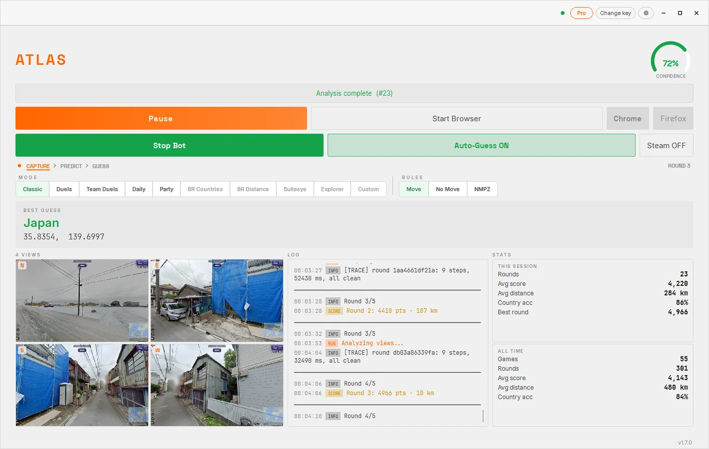

# ATLAS: an AI GeoGuessr cheat, bot and auto guess solver

ATLAS looks at the street view you are already looking at, works out where in the
world it is, and puts the pin there. On Windows it goes further and plays entire
sessions on its own. One licence key covers every place it runs: the Windows app,
the browser extension in Chrome and Firefox, and the iPhone and Android apps.

Website: **[geoguessrcheats.com](https://geoguessrcheats.com)**
Every platform, side by side: **[geoguessrcheats.com/platforms](https://geoguessrcheats.com/platforms)**

---

## Contents

- [What ATLAS actually does](#what-atlas-actually-does)
- [One key, five places to use it](#one-key-five-places-to-use-it)
- [A round, from start to pin](#a-round-from-start-to-pin)
- [Every platform has its own page](#every-platform-has-its-own-page)
- [How it got here: v1.0 to v1.7](#how-it-got-here-v10-to-v17)
- [Numbers we publish](#numbers-we-publish)
- [What it costs](#what-it-costs)
- [Two free userscripts, no key needed](#two-free-userscripts-no-key-needed)
- [Questions people ask before buying](#questions-people-ask-before-buying)
- [Links](#links)

---

## What ATLAS actually does

You are in a round. Somewhere there is a road, a signpost, a kerb, a tree line, a
number plate. ATLAS reads that picture and answers the question the game is
asking: which country, and roughly where inside it.

Three things follow from that, and which of them you get depends on where you run
it:

**It tells you.** The country, the region or town, and the coordinates appear
while the round is still open, so you can decide what to do with them.

**It places the guess.** Instead of you dragging the map around, the pin lands on
the spot it worked out.

**It plays.** On Windows only, it starts the game, plays the round, submits,
takes the next one, and keeps going. You can leave the desk.

What it does not do is move inside the round. It does not walk, pan or zoom the
street view looking for clues. It reads what is on screen and answers.

## One key, five places to use it

This is the honest table, including the boxes we cannot tick.

| | Windows app | Chrome | Firefox | iPhone app | Android app |
|---|---|---|---|---|---|
| Works out where you are | Yes | Yes | Yes | Yes | Yes |
| Drops the pin on the map for you | Yes | Yes | Yes | Yes | Yes |
| Presses Guess for you | Yes | Yes | No | Yes | Yes |
| Starts games and plays session after session | Yes | No | No | No | No |
| GeoGuessr on Steam | Yes | No | No | No | No |
| Free rounds before you buy | No | 7 | 7 | No | No |
| Also runs on macOS | No | Yes | Yes | No | No |
| Uses the same licence key | Yes | Yes | Yes | Yes | Yes |

Buy once, use it wherever you happen to be playing. The key is not tied to one of
these.

## A round, from start to pin

1. The round opens and the street view loads.
2. ATLAS takes the view as it is. No moving, no panning, no zooming for clues.
3. It works out the country first, then narrows down inside it.
4. You get a country, a region or town, a direction, and coordinates.
5. The pin goes on the map, and on every platform except Firefox it can press
   Guess as well.
6. On Windows it takes the next round by itself and repeats until you stop it.

Most rounds are answered in under three seconds.

## Every platform has its own page

Each of these has its own repository, because each one behaves differently enough
to deserve a straight answer rather than a footnote.

| Platform | Repository | The short version |
|---|---|---|
| Windows | [atlas-geoguessr-windows-app](https://github.com/Sven233333/atlas-geoguessr-windows-app) | The only one that plays unattended |
| Steam | [atlas-geoguessr-steam](https://github.com/Sven233333/atlas-geoguessr-steam) | The Steam client, driven by the Windows app |
| Chrome | [atlas-geoguessr-chrome-extension](https://github.com/Sven233333/atlas-geoguessr-chrome-extension) | Seven rounds free, nothing to install on your system |
| Firefox | [atlas-geoguessr-firefox-addon](https://github.com/Sven233333/atlas-geoguessr-firefox-addon) | Same panel, one missing button |
| macOS | [atlas-geoguessr-macos](https://github.com/Sven233333/atlas-geoguessr-macos) | Extension yes, desktop bot no |
| iPhone and iPad | [atlas-geoguessr-ios](https://github.com/Sven233333/atlas-geoguessr-ios) | On the phone, new in v1.7 |
| Android | [atlas-geoguessr-android](https://github.com/Sven233333/atlas-geoguessr-android) | On the phone, new in v1.7 |

## How it got here: v1.0 to v1.7

The full list with every entry lives at
[geoguessrcheats.com/changelog](https://geoguessrcheats.com/changelog). This is
the shape of it.

**v1.0, the open beta.** Country and coordinates straight from the street view,
most rounds done in a few seconds, and auto play that placed the guess and moved
on. Classic games, the World map and most country maps.

**v1.1, stability.** Crash and error page recovery so an overnight session did not
need a human to restart it, plus wider geographic coverage.

**v1.2, the training tools.** An ELO tracker, a weakness map that shows where you
personally lose points, scheduled sessions, multi monitor support and faster NMPZ
rounds.

**v1.3, speed and reach.** Up to ten times faster predictions, GPU support for
cards with 8 GB, the interface translated to English, engine tuning in settings,
and the lifetime plan.

**v1.4, the plumbing.** Sign in with Google, Discord, GitHub or Twitch. Crypto and
PayPal payment options. Better duels play. Another 80 percent off analysis time.

**v1.5, half the size.** The download went from around 7.5 GB to under 4 GB.
Updates install themselves and every one is signature checked. Scoring moved
server side, so it keeps working on a slow connection, and the bot stopped giving
up mid session: it now makes a guess every round.

**v1.6, more than one screen.** The Steam edition became playable on its own. The
Bot Scheduler plans a full week of modes on a seven day grid. New interface with
twenty themes and per game history. The map is scanned with real mouse movement
before the pin drops.

**v1.7, the phone.** The extension arrived on Firefox, the panel started working
on an iPhone and on Android, you can switch browsers without reinstalling, and
the bot stopped throwing away rounds it never had to lose.

## Numbers we publish

Two of them, and we would rather publish two we can stand behind than ten we
cannot.

- **81 percent** country accuracy in real games, not in a laboratory set.
- **111 countries** covered.
- Average score near **4,000** per round in the sessions behind that figure.

The reasoning behind those numbers, and what a fair comparison with other tools
looks like, is written up at
[geoguessrcheats.com/blog/geoguessr-ai-accuracy](https://geoguessrcheats.com/blog/geoguessr-ai-accuracy/).

## What it costs

| Plan | Price | Notes |
|---|---|---|
| Pro | 14.99 euro per month | Everything, month to month |
| Yearly | 33.50 euro per year | Works out to 2.79 euro per month |
| Lifetime | 50.00 euro once | Cheaper than four months of Pro |

Nothing renews on its own. Full detail and payment methods:
[geoguessrcheats.com/plans](https://geoguessrcheats.com/plans).

If you want to try before any of that, the Chrome and Firefox extensions give you
seven rounds without an account.

## Two free userscripts, no key needed

Both are MIT licensed, both are in [userscripts/](userscripts/), and neither has
anything to do with the paid product.

**GeoGuessr Round Journal.** Keeps a training journal of rounds you have already
finished: the real location, your guess, the distance, the score, a street view
link, and CSV or JSON export. It shows nothing during a round on purpose.

**GeoGuessr Round Timer.** A timer for your own rounds, for people who are trying
to get faster rather than more accurate.

## Questions people ask before buying

**Is there a free version of ATLAS?**
The browser extension gives you seven rounds free, with no account and no
download. The Windows app and the phone apps need a key.

**Does it work on a Mac?**
The extension does, in Firefox or Chrome, on the same key. The unattended bot
does not: there is no Mac build of the desktop app. See
[atlas-geoguessr-macos](https://github.com/Sven233333/atlas-geoguessr-macos).

**Does it work on GeoGuessr on Steam?**
Yes, through the Windows app, in all three movement rulesets. Windows only,
because the Steam edition has no Mac build.

**Can it play NMPZ?**
Yes. Classic, Duels, Team Duels and the Daily, in Move, No Move and NMPZ.

**Does it need a fast computer?**
No. Since v1.5 the heavy part runs on our side, which is also why it keeps
working on a slow connection.

**Do I have to install anything to try it?**
No. The extension runs in the browser you already have.

**Is my subscription going to renew without asking?**
No. Nothing renews on its own.

**Which one should I start with?**
If you want to watch it work, the extension. If you want it to play for you while
you do something else, the Windows app.

## Links

- Website: <https://geoguessrcheats.com>
- All platforms: <https://geoguessrcheats.com/platforms>
- Plans and pricing: <https://geoguessrcheats.com/plans>
- Frequently asked questions: <https://geoguessrcheats.com/faq>
- What players say: <https://geoguessrcheats.com/reviews>
- Blog and release notes: <https://geoguessrcheats.com/blog>
- Discord: <https://discord.gg/zwYXRgRRHc>

## Disclaimer

ATLAS is an independent project. It is not affiliated with, endorsed by, or
connected to GeoGuessr AB or any of the other games it can read. Using an
assistant may be against the rules of a given game or competition. Check those
rules and decide for yourself where you use it. The userscripts in this
repository are separate from the paid product and are published under the MIT
licence.
